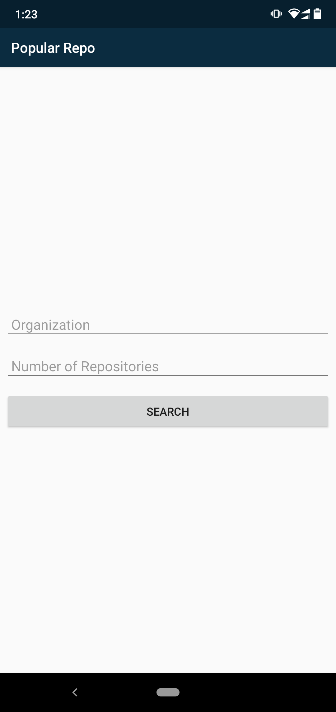
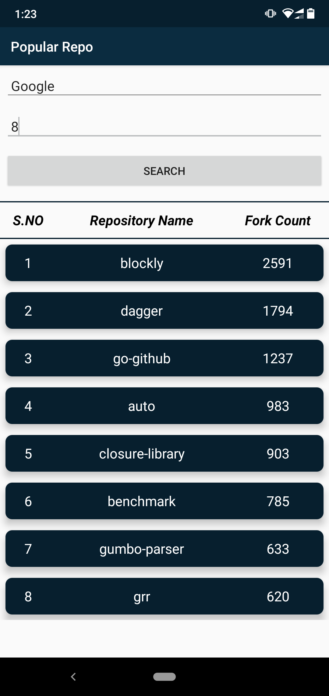
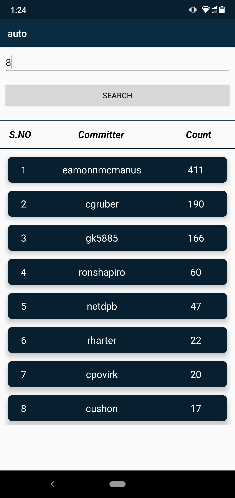

# Popular-Github-Repo
 
## Introduction
Android application to find popular repositories of desired organization on github and for each repository the top committess.

## Approach
I have used the API https://api.github.com/orgs/:org/repos to list all repositories of an organization. You can find its documentation [here](https://developer.github.com/v3/repos/#list-organization-repositories).

Based on the number of forks on each repo, I have sorted and displayed then on the activity using RecyclerView. User can tap on each RecyclerView item to find the top Committes on that repository.

## Screenshots
This is the home page where you enter the organization's name and the number of repositories you wish to see.  

    

Result of above query. You can tap on any of the item to find the top committes. 
    

These are the top committes on a particular repository.  

